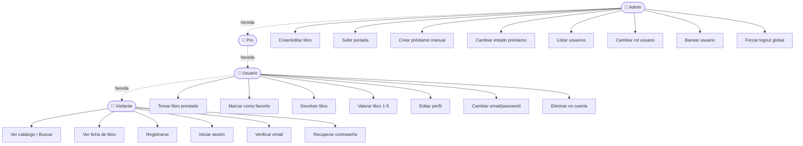
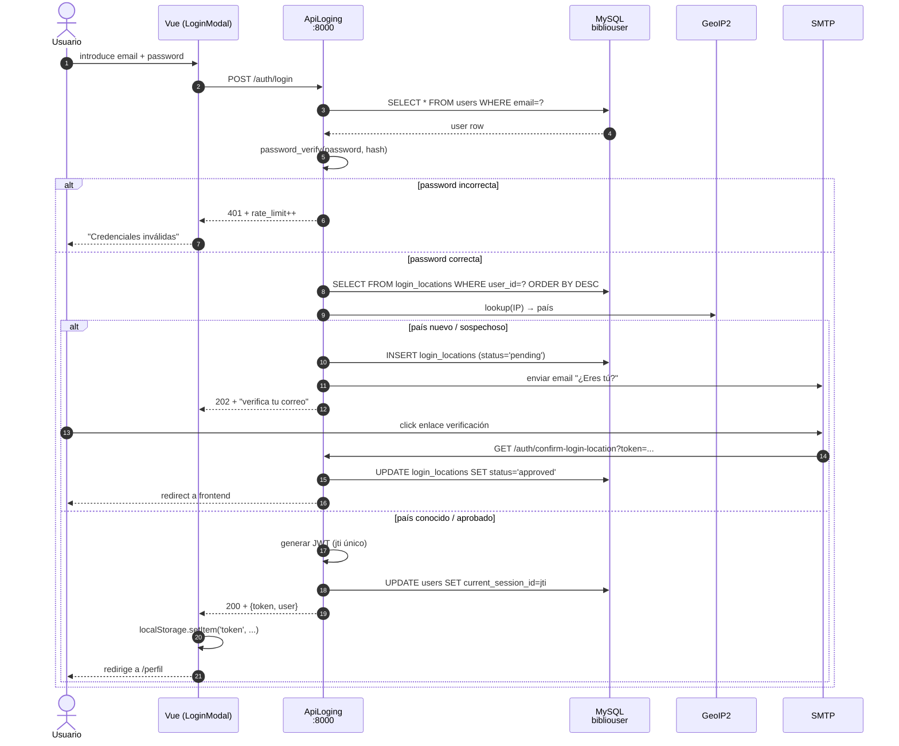
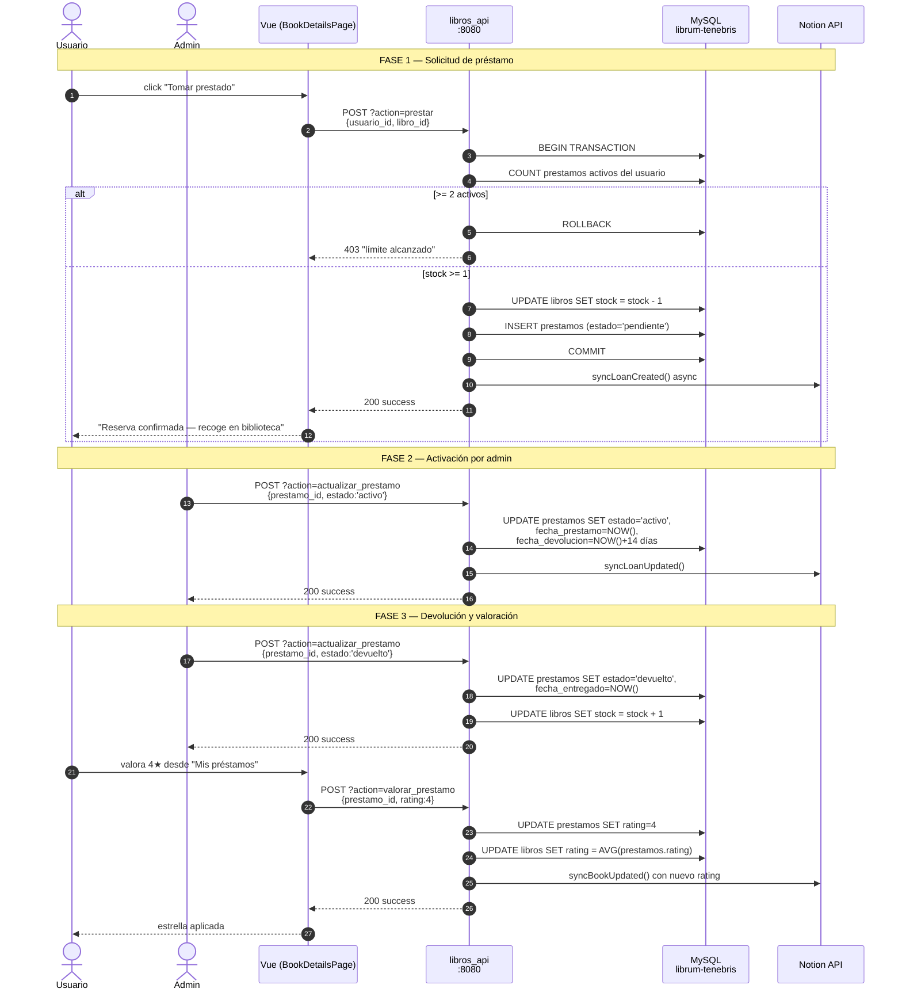
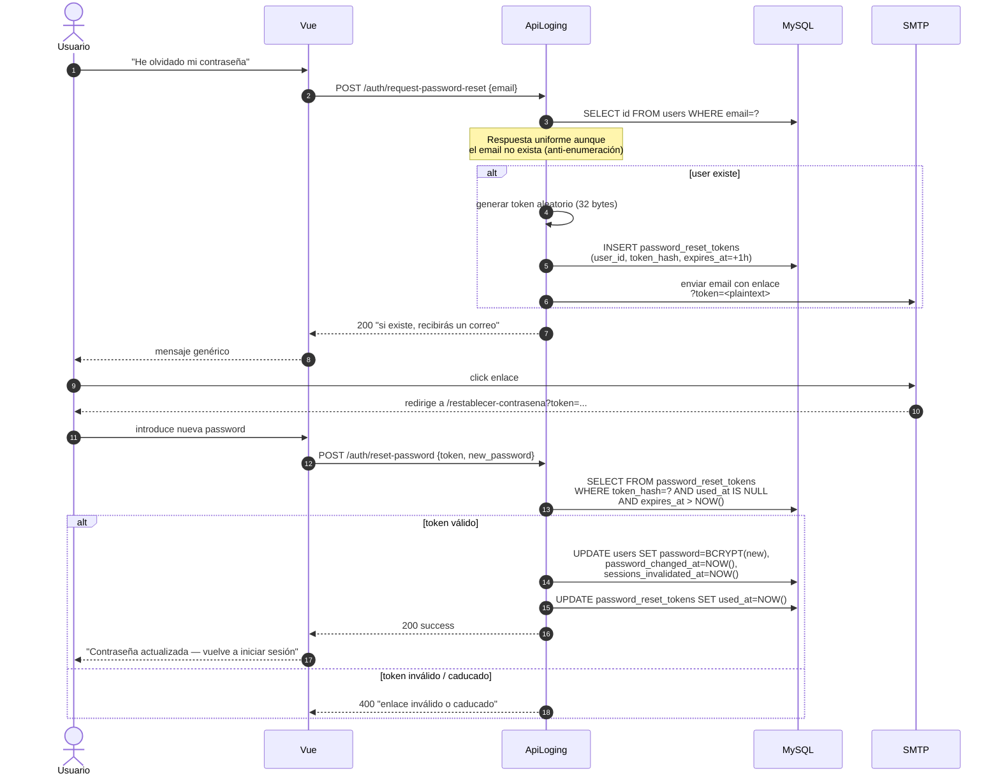
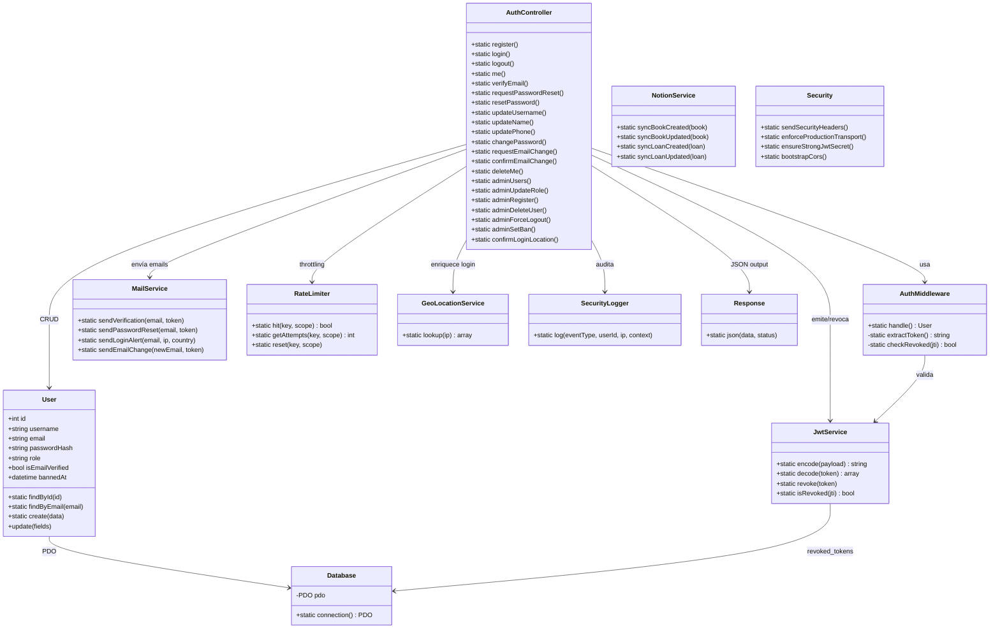

# Diagramas UML — Librum Tenebris

Diagramas UML del sistema, en notación **Mermaid** (renderiza directamente
en GitHub, GitLab, VS Code y la mayoría de visores de Markdown).

Se cubren los tres tipos más relevantes para un TFG de DAW:

1. **Casos de uso** — qué puede hacer cada rol.
2. **Secuencia** — flujos críticos paso a paso (login con JWT, préstamo y
   recuperación de contraseña).
3. **Clases** — estructura de clases del backend `ApiLoging`.

---

## 1. Diagramas de casos de uso

El sistema reconoce **4 actores** con permisos crecientes:

| Actor | Hereda de | Capacidades extra |
|---|---|---|
| **Visitante** | — | Navegar catálogo público, registrarse, login. |
| **Usuario** | Visitante | Tomar libros prestados (máx. 2), favoritos, perfil. |
| **Pro** | Usuario | (Reservado para funcionalidad futura: recomendaciones avanzadas, lectura sin límite). |
| **Admin** | Pro | Panel de carga, CRUD de libros, gestión de préstamos y usuarios. |

### 1.1 Casos de uso por rol



### 1.2 Caso de uso detallado: tomar un libro prestado

| Atributo | Valor |
|---|---|
| **Actor principal** | Usuario autenticado |
| **Precondición** | Usuario logueado, email verificado, no baneado, < 2 préstamos activos |
| **Postcondición (éxito)** | Préstamo en estado `pendiente`, stock −1 |
| **Postcondición (fallo)** | No se modifica nada (transacción rollback) |

**Flujo principal:**

1. Usuario abre la ficha de un libro (`/libro/:id`).
2. Click en **"Tomar prestado"**.
3. Frontend → `POST /api/?action=prestar` con `{usuario_id, libro_id}`.
4. Backend valida: ≤ 1 préstamo activo, stock > 0.
5. Backend transaccional: descuenta stock, crea fila `prestamos` (`pendiente`).
6. Backend sincroniza con Notion (asíncrono, no bloquea respuesta).
7. Frontend muestra confirmación + actualiza vista de "Mis préstamos".

**Flujos alternativos:**

- **A1** — Ya tiene 2 préstamos activos → 403 con mensaje.
- **A2** — Stock = 0 → 400 "Libro agotado".
- **A3** — Concurrencia (otro usuario lo cogió primero) → rollback + 400.
- **A4** — Notion no responde → préstamo se crea igualmente, sync se reintenta luego.

---

## 2. Diagramas de secuencia

### 2.1 Login con JWT y detección de localización geográfica



### 2.2 Flujo completo de préstamo (con valoración posterior)



### 2.3 Recuperación de contraseña



---

## 3. Diagrama de clases — `ApiLoging`

Estructura simplificada del backend de autenticación, agrupada por capas
(MVC + servicios + utilidades).



---

## 4. Diagrama de despliegue (producción Hostinger)

```mermaid
flowchart TB
    subgraph Cliente
        Nav[Navegador]
    end

    subgraph Hostinger["Hostinger Premium · public_html/"]
        Apache[Apache 2.4 + .htaccess]
        subgraph Static["Estático (Vue build)"]
            Index[index.html]
            JS[JS chunks]
            CSS[CSS]
            Robots[robots.txt + sitemap.xml]
        end
        subgraph Auth["Subcarpeta /auth/"]
            APHP[ApiLoging<br/>index.php]
            Vendor[vendor/<br/>JWT, PHPMailer, GeoIP2]
        end
        subgraph Api["Subcarpeta /api/"]
            LPHP[libros_api.php]
            Uploads[uploads/covers/]
        end
    end

    subgraph Mysql_Hostinger["MySQL Hostinger"]
        DBA[(bibliouser)]
        DBL[(librum-tenebris)]
    end

    subgraph Externos
        SMTP[SMTP Hostinger<br/>mail()]
        Notion[Notion API]
    end

    Nav -->|HTTPS| Apache
    Apache --> Static
    Apache -->|/auth/*| APHP
    Apache -->|/api/*| LPHP
    APHP --> Vendor
    APHP --> DBA
    LPHP --> DBL
    LPHP --> DBA
    APHP -.-> SMTP
    LPHP -.-> Notion
```

---

## Referencias

- **UML 2.5.1 — OMG Specification**: <https://www.omg.org/spec/UML/2.5.1/>
- **Mermaid (sintaxis ER y secuencia)**: <https://mermaid.js.org/intro/>
- **Casos de uso (Cockburn)**: *Writing Effective Use Cases*, Alistair Cockburn, 2000.
