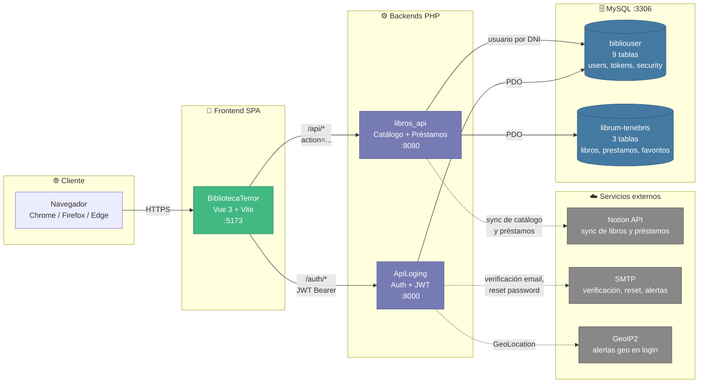

# Librum Tenebris — Proyecto Final FP DAW

[](LICENSE)
[](https://vuejs.org/)
[](https://vitejs.dev/)
[](https://www.php.net/)
[](https://www.mysql.com/)
[](https://mediumvioletred-grouse-788941.hostingersite.com)
[](Documentacion/)

Trabajo de Fin de Grado del ciclo **DAW** (Desarrollo de Aplicaciones Web).
Una biblioteca digital especializada en literatura de terror, con
autenticación centralizada, catálogo de libros y panel de carga.

> **Demo en producción** — [mediumvioletred-grouse-788941.hostingersite.com](https://mediumvioletred-grouse-788941.hostingersite.com)
> Desplegado en Hostinger (Premium Web Hosting).

## Estructura del repositorio

| Carpeta | Descripción |
|---|---|
| [`BibliotecaTerror/`](BibliotecaTerror/) | Frontend SPA en **Vue 3 + Vite**. Catálogo, fichas de libro, autenticación. |
| [`ApiLoging/`](ApiLoging/) | Backend **PHP MVC** de identidad: registro, login, JWT, gestión de usuarios. |
| [`backend/libros_api/`](backend/libros_api/) | API PHP del catálogo de libros (CRUD + uploads de portadas). |
| [`backend/cargalibros/`](backend/cargalibros/) | Panel de administración para alta, edición, importación y traducción de libros. |
| [`database/`](database/) | Esquemas SQL e instalador de las bases de datos. |
| [`Documentacion/`](Documentacion/) | Memoria del TFG: anteproyecto, planificación y documentación técnica. |
| [`ReleasesEstables/`](ReleasesEstables/) | Paquetes estables listos para subir a Hostinger (`public_html/` + SQLs). Convención: `RELEASE_HOSTINGER_LIBRUMTENEBRIS_<YYYY-MM-DD>_V<N>`. |

## Stack técnico

**Frontend** — Vue 3, Vite, Vue Router, Pinia, Axios, Swiper.
**Backend** — PHP 8 (arquitectura MVC), JWT para autenticación.
**Base de datos** — MySQL (dos bases: `bibliouser` y `librum-tenebris`).
**Entorno de desarrollo** — XAMPP (Apache + MySQL).

## Arquitectura del sistema

El frontend SPA consume **dos backends PHP independientes** (auth y catálogo)
que persisten en **dos bases de datos MySQL separadas**. Esta separación
permite reutilizar `ApiLoging` en otros proyectos del ecosistema sin
arrastrar tablas de catálogo.



## Prerrequisitos

Hay dos formas de evaluar el proyecto:

- **Vía rápida — demo en producción.** No requiere instalar nada. Abrir
  [mediumvioletred-grouse-788941.hostingersite.com](https://mediumvioletred-grouse-788941.hostingersite.com)
  en cualquier navegador moderno. Para acceder al panel de administración, las
  credenciales se facilitan al tribunal en el acto de defensa.
- **Vía local completa.** Levantar el proyecto en la máquina del evaluador.
  Requiere los programas listados abajo y seguir la sección
  [Cómo arrancarlo](#cómo-arrancarlo).

> El bundle de producción precompilado (`BibliotecaTerror/dist/`) viene
> incluido en la entrega como referencia (es el mismo artefacto que se ha
> desplegado en Hostinger), pero **no se puede servir aislado en local**: las
> llamadas a la API usan rutas relativas y dependen del proxy de Vite
> (`npm run dev`) o de que frontend y backends compartan dominio (Hostinger).
> Si se quiere ver el proyecto funcionando localmente hay que seguir la vía
> local completa.

### Software requerido (vía local completa)

| # | Programa | Versión | Para qué |
|---|---|---|---|
| 1 | [XAMPP](https://www.apachefriends.org/) | 8.x | Aporta **MySQL/MariaDB**. Apache no se usa, los backends PHP se sirven con `php -S`. |
| 2 | [PHP](https://www.php.net/downloads) | **8.0+** | Backends `ApiLoging` y `libros_api`. El que trae XAMPP (`C:\xampp\php\php.exe`) vale; alternativamente un PHP standalone en el `PATH`. |
| 3 | [Node.js](https://nodejs.org/) | **20+** (probado con 24) | Frontend Vue 3 + Vite (`npm run dev`). Incluye `npm` (probado con 11.x). |
| 4 | [Composer](https://getcomposer.org/) | 2.x | **Opcional**: solo si se van a actualizar las dependencias PHP de `ApiLoging`. La carpeta `vendor/` ya está versionada. |
| 5 | [Git](https://git-scm.com/) | — | **Opcional**: solo si se clona el repositorio. La entrega como `.zip` no lo requiere. |
| — | Navegador moderno | — | Chrome, Firefox o Edge en versión actualizada. |

> **Extensiones PHP requeridas**: `pdo_mysql`, `mbstring`, `openssl`, `curl`,
> `fileinfo`, `gd`. Todas vienen activas en XAMPP por defecto.

### Orden de instalación recomendado

1. **Instalar [XAMPP](https://www.apachefriends.org/)** — al terminar, abrir el
   *XAMPP Control Panel* y arrancar **MySQL** (el módulo Apache no se usa,
   los backends se levantan con `php -S`).
2. **Verificar PHP** — el PHP de XAMPP (`C:\xampp\php\php.exe`) ya incluye
   todas las extensiones requeridas. Añadirlo al `PATH` o llamarlo por su ruta
   absoluta en los comandos del paso "Cómo arrancarlo".
3. **Instalar [Node.js](https://nodejs.org/) 20+** — necesario para levantar
   el frontend con `npm run dev` (Vite hace de proxy de los backends).
4. **Importar las bases de datos** — desde phpMyAdmin (`http://localhost/phpmyadmin`)
   importar `database/install_databases.sql`. Crea las dos bases
   (`bibliouser` y `librum-tenebris`) y carga el seed inicial.
5. **Arrancar los backends y el frontend** — seguir el orden estricto de la
   sección [Cómo arrancarlo](#cómo-arrancarlo) (ApiLoging :8000 →
   libros_api :8080 → Vite :5173).

## Servicios y puertos (desarrollo)

| # | Servicio | Puerto | Carpeta |
|---|---|---|---|
| 1 | ApiLoging (auth/JWT) | `8000` | `ApiLoging/` |
| 2 | libros_api (catálogo) | `8080` | `backend/libros_api/` |
| 3 | Frontend Vite (Vue 3) | `5173` | `BibliotecaTerror/` |
| — | MySQL | `3306` | XAMPP Control Panel (manual) |

## Cómo arrancarlo

> **Convención de los bloques de código**: cada bloque indica explícitamente
> el shell esperado (`bash`, `powershell`, `cmd` o `sql`). Donde el comando
> diverge entre Git Bash (Linux/macOS) y consolas nativas de Windows, se
> incluyen las dos versiones.

### 1. Base de datos

Arranca **MySQL desde el Control Panel de XAMPP** y ejecuta el instalador
desde la consola de MySQL (o desde phpMyAdmin → Importar):

```sql
-- Cliente MySQL / phpMyAdmin
SOURCE database/install_databases.sql;
```

Esto crea las dos bases (`bibliouser` para usuarios y `librum-tenebris` para
el catálogo) y carga el seed inicial.

> **Pruebas con libros adicionales** — si necesitas poblar el catálogo con
> más libros para pruebas, ejecuta manualmente el importador de Google Books
> (inserta 100 libros de terror filtrando los que tengan autor, descripción
> y portada). Requiere `pip install requests mysql-connector-python`:
>
> ```bash
> cd backend/cargalibros
> python importar_libros_googlebooks.py
> ```

### 2. Backends y frontend (orden estricto)

Lanza los tres servicios en este orden, con una pequeña pausa entre cada
uno. Cada `&` envía el proceso a background y los logs van a `/tmp/`:

**Bash / Git Bash** (Windows con Git for Windows, Linux o macOS):

```bash
cd "ApiLoging" && php -S localhost:8000 > /tmp/libratenebris_01_apiloging.log 2>&1 &
sleep 1
php -S localhost:8080 -t "backend/libros_api" > /tmp/libratenebris_02_libros.log 2>&1 &
sleep 1
cd "BibliotecaTerror" && npm run dev > /tmp/libratenebris_03_vite.log 2>&1 &
sleep 3
```

**PowerShell** (Windows — equivalente con `Start-Process` en background):

```powershell
$logs = $env:TEMP
Start-Process php -ArgumentList '-S','localhost:8000' -WorkingDirectory 'ApiLoging' -RedirectStandardOutput "$logs\libratenebris_01_apiloging.log" -RedirectStandardError "$logs\libratenebris_01_apiloging.err" -WindowStyle Hidden
Start-Sleep 1
Start-Process php -ArgumentList '-S','localhost:8080','-t','backend/libros_api' -RedirectStandardOutput "$logs\libratenebris_02_libros.log" -RedirectStandardError "$logs\libratenebris_02_libros.err" -WindowStyle Hidden
Start-Sleep 1
Start-Process npm.cmd -ArgumentList 'run','dev' -WorkingDirectory 'BibliotecaTerror' -RedirectStandardOutput "$logs\libratenebris_03_vite.log" -RedirectStandardError "$logs\libratenebris_03_vite.err" -WindowStyle Hidden
Start-Sleep 3
```

> Si es la primera vez, ejecuta `npm install` dentro de `BibliotecaTerror/`
> antes del paso del frontend.

### 3. Verificación

Comprueba que los tres servicios responden:

**Bash / Git Bash**:

```bash
curl -s -o /dev/null -w "ApiLoging  /auth/me  : HTTP %{http_code}\n" http://localhost:8000/auth/me
curl -s -o /dev/null -w "libros_api recientes : HTTP %{http_code}\n" "http://localhost:8080/libros_api.php?action=recientes&limit=1"
curl -s -o /dev/null -w "Vite       /         : HTTP %{http_code}\n" http://localhost:5173/
```

**PowerShell** (usa `Invoke-WebRequest` en vez de `curl` para evitar el alias por defecto):

```powershell
@(
  @{ Nombre='ApiLoging  /auth/me '; Url='http://localhost:8000/auth/me' },
  @{ Nombre='libros_api recientes'; Url='http://localhost:8080/libros_api.php?action=recientes&limit=1' },
  @{ Nombre='Vite       /        '; Url='http://localhost:5173/' }
) | ForEach-Object {
  try {
    $r = Invoke-WebRequest -Uri $_.Url -UseBasicParsing -SkipHttpErrorCheck
    "$($_.Nombre): HTTP $($r.StatusCode)"
  } catch { "$($_.Nombre): HTTP $($_.Exception.Response.StatusCode.value__)" }
}
```

Códigos esperados:

| Endpoint | Código | Por qué |
|---|---|---|
| `ApiLoging /auth/me` sin token | **401** | El server responde y el middleware JWT actúa. |
| `libros_api ?action=recientes` | **200** | Catálogo accesible (requiere MySQL up). |
| `Vite /` | **200** | Servidor de desarrollo respondiendo. |

Una vez verificado, abre [http://localhost:5173](http://localhost:5173).

### 4. Cómo parar todo

**Bash / Git Bash** (el doble `//` es Git Bash-específico, escapa el slash):

```bash
taskkill //F //IM php.exe
taskkill //F //IM node.exe
```

**PowerShell** (forma idiomática):

```powershell
Get-Process php  -ErrorAction SilentlyContinue | Stop-Process -Force
Get-Process node -ErrorAction SilentlyContinue | Stop-Process -Force
```

**CMD** (Windows nativo, slash sencillo):

```cmd
taskkill /F /IM php.exe
taskkill /F /IM node.exe
```

> Esto mata **todos** los procesos PHP y Node del sistema. Si tienes otros
> proyectos corriendo, párelos selectivamente por PID:
>
> ```cmd
> :: CMD/PowerShell — listar PIDs en escucha
> netstat -ano | findstr LISTENING
> :: Después matar el PID concreto
> taskkill /PID <pid> /F
> ```

## Modo producción (build) — pruebas reales de SEO

`npm run dev` levanta el servidor de Vite con hot-reload, pero **el HTML
servido no es el final**: meta tags inyectadas dinámicamente, sin
minificación y con módulos sin agrupar. Para auditar SEO, Open Graph,
sitemap o robots de forma realista hay que servir el **build de
producción**.

### 1. Compilar el frontend

Funciona en **cualquier shell** (Bash, PowerShell o CMD) — `npm` es
multiplataforma:

```bash
cd "BibliotecaTerror"
npm run build
```

Esto genera la carpeta `BibliotecaTerror/dist/` con el HTML, JS y CSS
minificados, más los activos estáticos de SEO (`robots.txt`, `sitemap.xml`,
`og-image.png`, `favicon.ico`).

### 2. Servir el build

```bash
npm run preview
```

Vite Preview sirve `dist/` en [http://localhost:4173](http://localhost:4173)
con el HTML real que verán los crawlers (Googlebot, Lighthouse, validadores
de Open Graph, etc.).

> **Aviso** — el proxy `/auth` y `/api` de `vite.config.js` solo aplica al
> servidor de desarrollo, **no a `preview`**. Para SEO esto da igual (las
> metas, OG, JSON-LD, sitemap y robots son estáticos en `dist/`), pero si
> necesitas que la app llame a los backends durante el preview, levanta
> también `ApiLoging` (8000) y `libros_api` (8080) y configura un proxy
> propio o accede a las URLs absolutas.

### 3. Herramientas recomendadas para auditar

- **[Lighthouse](https://developer.chrome.com/docs/lighthouse/overview)** (DevTools de Chrome) — performance, SEO y accesibilidad.
- **[OpenGraph.xyz](https://www.opengraph.xyz/)** — vista previa de las cards de redes sociales.
- **[Rich Results Test](https://search.google.com/test/rich-results)** — validación del JSON-LD.
- **[validator.w3.org](https://validator.w3.org/)** — HTML semántico.

## Documentación

Toda la memoria del TFG está en [`Documentacion/`](Documentacion/):

- [`DOCUMENTACION.md`](Documentacion/DOCUMENTACION.md) — documento general.
- [`documentacion_frontend.md`](Documentacion/documentacion_frontend.md) — arquitectura del frontend Vue.
- [`documentacion_backend.md`](Documentacion/documentacion_backend.md) — diseño de los backends PHP.
- [`documentacion_basedatos.md`](Documentacion/documentacion_basedatos.md) — modelo de datos, esquemas SQL y **diagrama ER**.
- [`documentacion_uml.md`](Documentacion/documentacion_uml.md) — **diagramas UML**: casos de uso por rol, secuencia (login JWT, préstamo, recuperación de password), clases del backend y despliegue en Hostinger.
- [`documentacion_api.md`](Documentacion/documentacion_api.md) — **referencia completa de la API REST** (ApiLoging + libros_api).
- [`documentacion_estilos.md`](Documentacion/documentacion_estilos.md) — sistema de diseño y estilos.
- [`documentacion_seo.md`](Documentacion/documentacion_seo.md) — estrategia de SEO.
- [`bibliografia.md`](Documentacion/bibliografia.md) — fuentes consultadas (Vue, PHP, RFC 7519 JWT, OWASP, WCAG, Schema.org…).
- [`postman/Librum_Tenebris.postman_collection.json`](Documentacion/postman/Librum_Tenebris.postman_collection.json) — colección Postman lista para importar (login auto-rellena `{{jwt}}` y `{{usuario_id}}`).
- [`RELEASES.md`](Documentacion/RELEASES.md) — guía para empaquetar releases y desplegar en Hostinger.
- [`CAMBIOS_APILOGING_2026-04-23.md`](Documentacion/CAMBIOS_APILOGING_2026-04-23.md) — changelog de la sincronización de seguridad de ApiLoging.
- [`snippets_documentacion.md`](Documentacion/snippets_documentacion.md) — fragmentos de código destacados para la memoria del TFG.
- [`TFG-Planificacion.pdf`](Documentacion/TFG-Planificacion.pdf) — planificación temporal.
- [`anteproyecto_daw.pdf`](Documentacion/anteproyecto_daw.pdf) — anteproyecto inicial.

## Capturas y manual de usuario

Las **capturas de la interfaz** y el **manual de usuario** completo (con
guías paso a paso para visitante, usuario y administrador) se encuentran
en la **memoria del TFG** entregada como parte de la documentación
académica del proyecto.

> Si quieres probar la aplicación directamente, abre la
> [demo en producción](https://mediumvioletred-grouse-788941.hostingersite.com)
> y regístrate con un email real — el flujo de registro, verificación de
> correo y login es totalmente funcional. Para acceder a las funcionalidades
> de administración (panel de carga, gestión de usuarios y préstamos), las
> credenciales se facilitan al tribunal en el acto de defensa.

## Autores

Proyecto desarrollado como Trabajo de Fin de Grado del ciclo de Desarrollo
de Aplicaciones Web por:

- **Jorge Núñez Granero**
- **Alejandro del Campo Ortiz**
- **Eva María Sánchez Zamora**

## Licencia

Distribuido bajo licencia **MIT**. Ver [`LICENSE`](LICENSE) para los términos
completos.
